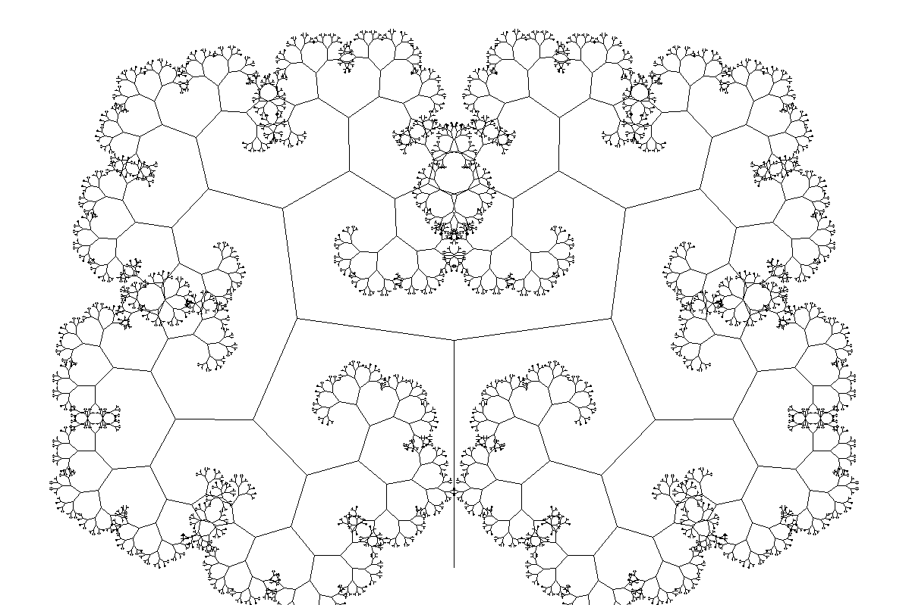

## Fractal Tree Generation
A Simple program to generate Fractal Trees written in rust.


### How to Run the Program
```
$ cargo run
```

### Change Parameters
Tweak the values of Spread and Length Change to modify the output
```rust
const SPREAD: f32 = 1.1;
const LENGTH_CHANGE: f32 = 0.7;
```
